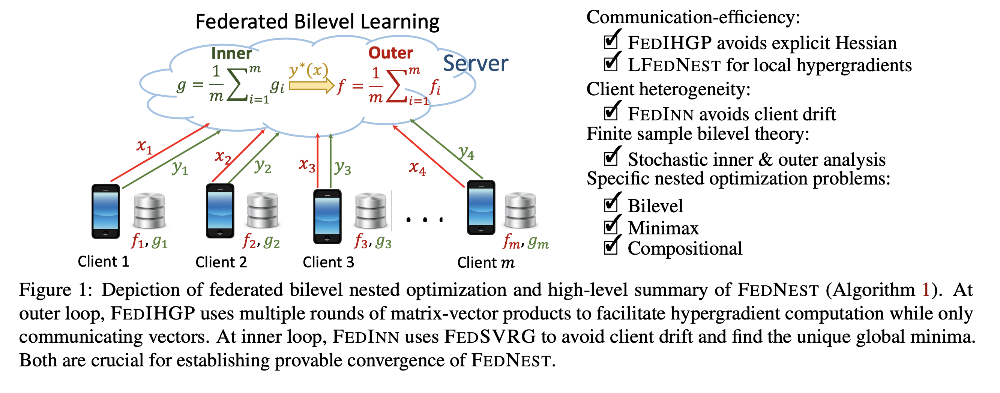
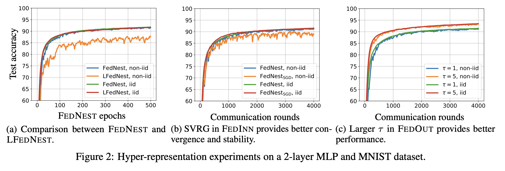
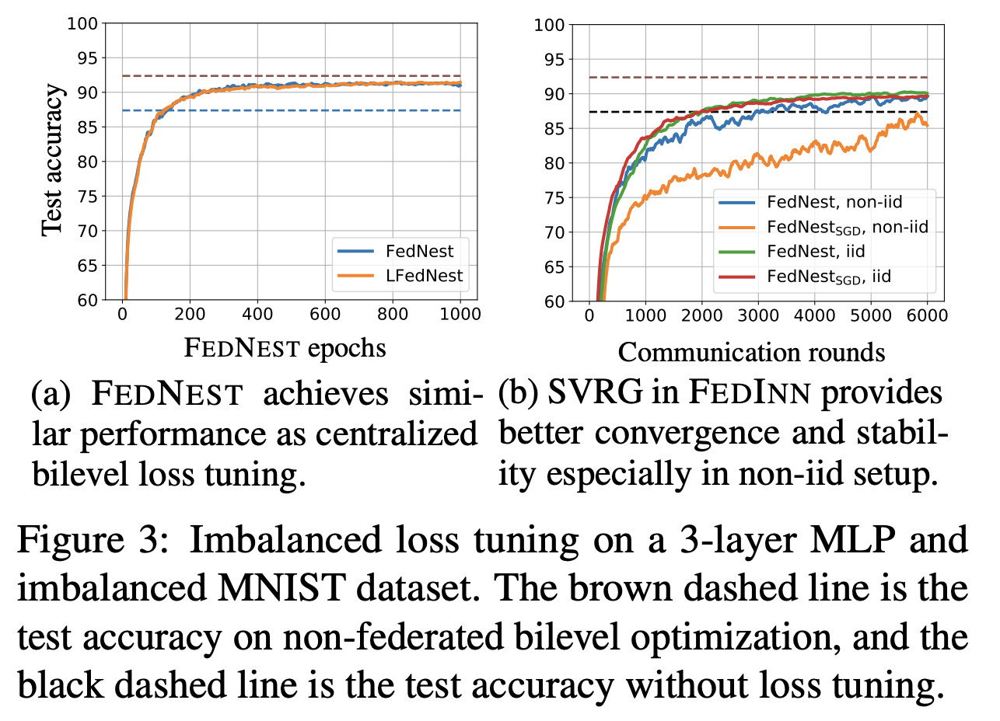
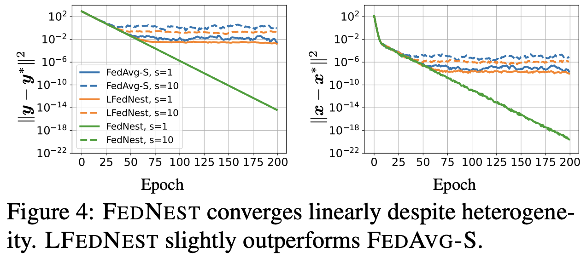
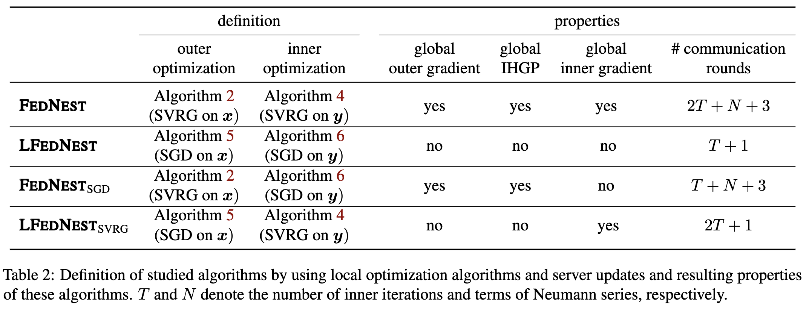

# FEDNEST: Federated Bilevel, Minimax, and Compositional Optimization

This directory contains source code for evaluating federated bilevel learning with different optimizers on various models and tasks.  The code was originally developed for the paper [*FEDNEST: Federated Bilevel, Minimax, and Compositional Optimization*](https://arxiv.org/abs/2205.02215), in ICML 2022. 

The federated code is adopted from [shaoxiongji's](https://github.com/shaoxiongji/federated-learning) implenmentation under MIT license. The bilevel implenmentation follows the algorithm of [*Optimizing Millions of Hyperparameters by Implicit Differentiation (Jonathan Lorraine, Paul Vicol, David Duvenaud)*](https://arxiv.org/abs/1911.02590). The parametric loss tuning experiments on imbalanced dataset follows the loss function design idea of [*AutoBalance: Optimized Loss Functions for
Imbalanced Data(Mingchen Li
, Xuechen Zhang, Christos Thrampoulidis, Jiasi Chen, Samet Oymak)*](https://openreview.net/pdf?id=ebQXflQre5a), but we only use MNIST in imbalanced loss function design.

Note: The scripts will be slow without the implementation of parallel computing. 

## Requirements
python>=3.6  
pytorch>=0.4

## Reproduce Run

### Figure 2

To reproduce the hyper-representation experiments on MNIST dataset, the [**script**](reproduce/fig2.sh) provides the setup. After running this script, use following command to generate the corresponding figure.
>python reproduce/fig2.py

### Figure 3

To reproduce the imbalanced learning experiments on MNIST dataset, the [**script**](reproduce/fig3.sh) provides the setup. After running this script, use following command to generate the corresponding figure.
>python reproduce/fig3.py

### Figure 4

For Figure 4, directly runing the jupyter notebook file [minmax_synthetic.ipynb](minmax_synthetic.ipynb) will generate the result.

## Customize Run

The hyper-representation experiments are produced by:
> python [main_hr.py](main_hr.py)

The imbalanced MNIST experiments are produced by:
> python [main_imbalance.py](main_imbalance.py)

The min-max synthetic experiments are produced in the Jupyter Notebook [minmax_synthetic.ipynb](minmax_synthetic.ipynb)

A simple run example is as following
> python main_hr.py --iid --epochs 50 --gpu 0 

By control the augments, there can be more configuration. In the paper, the authors mainly discuss four varients of FedNest. Here we provide the corresponding parameters to run each of them:

- FedNest
    > --hvp_method global --optim svrg
- LFedNest
    > --hvp_method seperate --optim sgd
- FedNestSGD
    > --hvp_method global --optim sgd
- LFedNestSVRG
    > --hvp_method seperate --optim svrg

To control the epoch, data distribution (iid or non-iid), inner learning rate, outer learning rate, the arguments are availiable:
> --epoch [epoch number] --iid [default is non-iid, with argument iid client data is iid] --hlr [outer learning rate] --lr [inner learning rate]

More arguments are avaliable in [options.py](utils/options.py). 
